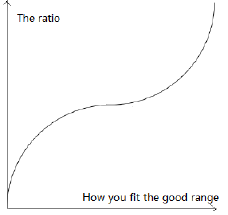

## Slacker score description

The slacker score is calculated accroding to you timer record of a week. If your total time
spent of a specific timer is considered as good, you will receive full grade of the evaluation
of this timer. If the total time spent is not good but within the reasonable limit, you will
receive partial grade. Otherwise, you will not receive any grade for this timer.

### How we calculate your score

The slacker score is the sum of four timers. Each score of a timer is the result of the base
mutiplied by correction and ratio. The ratio represents how your timer fits the good range.

The ratio is considerd in the following:

### How we consider your timer is list as follow:

|                      |   Good Range    |   Limit Range   | Correction |
| :------------------: | :-------------: | :-------------: | :--------: |
|         Work         | 30 to 40 hours  | 20 to 50 hours  |    1.35    |
|         Play         |  5 to 20 hours  |  0 to 30 hours  |    1.1     |
|       Offline        | 84 to 100 hours | 56 to 112 hours |    0.9     |
| Not starting a timer |  0 to 2 hours   |  2 to 8 hours   |     1      |
